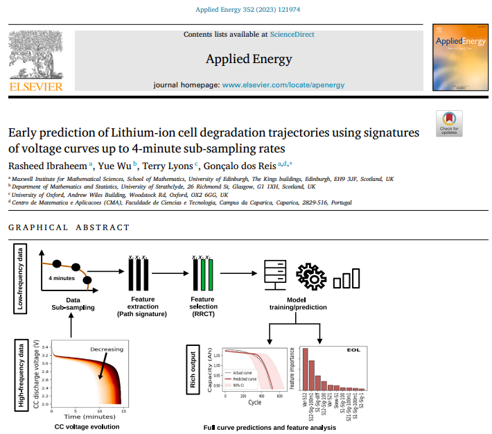

# signature-project
This repository contains the codes for all the experiments performed in the paper [Early prediction of Remaining Useful Life for Lithium-ion cells using only signatures of voltage curves at 4 minute sampling rates.](https://www.sciencedirect.com/science/article/pii/S0306261923013387?via%3Dihub#fig2)

Below is the graphical abstract of the research paper:


## Set up for running locally
1. Clone the repository by running
    ```
    git clone https://github.com/Rasheed19/signature-project.git
    ```
1. Navigate to the root folder, i.e., `signature-project` and create a python virtual environment by running
    ```
    python3 -m venv .venv
    ``` 
1. Activate the virtual environment by running
    ```
    source .venv/bin/activate
    ```
1. Prepare all modules and required directories by running the following:
    ```
    make setup
    make create-required-dir
    ```
1. Run `run_download.py` to download the raw data used in this study. These are the data that correspond to
    - all the batches of data in this link https://data.matr.io/1/ which are the data for the papers [Data driven prediciton of battery cycle life before capacity degradation by K.A. Severson, P.M. Attia, et al](https://www.nature.com/articles/s41560-019-0356-8) and [Attia, P.M., Grover, A., Jin, N. et al. Closed-loop optimization of fast-charging protocols for batteries with machine learning. Nature 578, 397–402 (2020).](https://doi.org/10.1038/s41586-020-1994-5)
    - the internal resistance data used to complement batch 8 downloaded from https://doi.org/10.7488/ds/2957 which is published in the paper [Strange, C.; Li, S.; Gilchrist, R.; dos Reis, G. Elbows of Internal Resistance Rise Curves in Li-Ion Cells. Energies 2021, 14, 1206.](https://doi.org/10.3390/en14041206)

1. You can then start running entry points (`run_train.py` and `run_experiment.py` for the model training and various experiment pipelines respectively) with their respective arguments as CLI. For instance to train the proposed models, using the proposed train-test cell splits, including the feature importance and parity analysis, and given that the data has not been loaded, run:
    ```
    python run_train.py --not-loaded --include-analysis
    ```
    To see all the available arguments or options to an entry point, e.g., for training pipeline entry point run:
    ```
    python run_train.py --help
    ```

If you use this work in your project, please reference:

    @article{IBRAHEEM2023121974,
        title = {Early prediction of Lithium-ion cell degradation trajectories using signatures of voltage curves up to 4-minute sub-sampling rates},
        author = {Rasheed Ibraheem and Yue Wu and Terry Lyons and Gonçalo {dos Reis}},
        journal = {Applied Energy},
        volume = {352},
        pages = {121974},
        year = {2023},
        issn = {0306-2619},
        doi = {https://doi.org/10.1016/j.apenergy.2023.121974},
        url = {https://www.sciencedirect.com/science/article/pii/S0306261923013387}
    }
